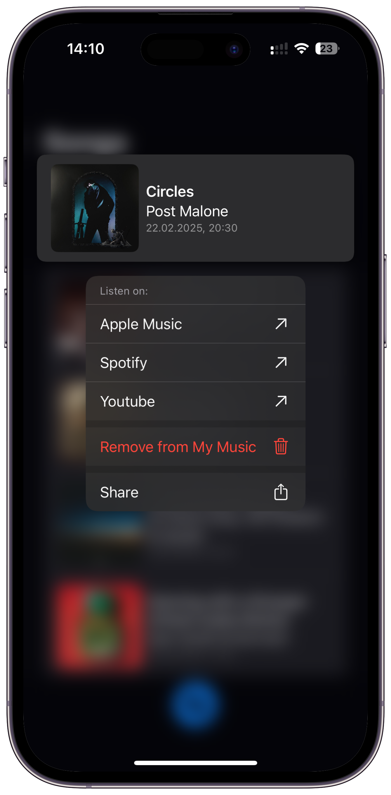

# ShazamKitExample

An example app with using ShazamKit. Check out [a live demo on Twitter](https://twitter.com/iosartem/status/1402967141712814089).

  
  

## Related Resources

- [Introducing ShazamKit](https://developer.apple.com/shazamkit)
- [WWDC21 — Explore ShazamKit](https://developer.apple.com/videos/play/wwdc2021/10044)
- [WWDC21 — Create custom audio experiences with ShazamKit](https://developer.apple.com/videos/play/wwdc2021/10045)

## Author

Artem Novichkov, mail@artemnovichkov.com

## License

The project is available under the MIT license. See the [LICENSE](./LICENSE) file for more info.
